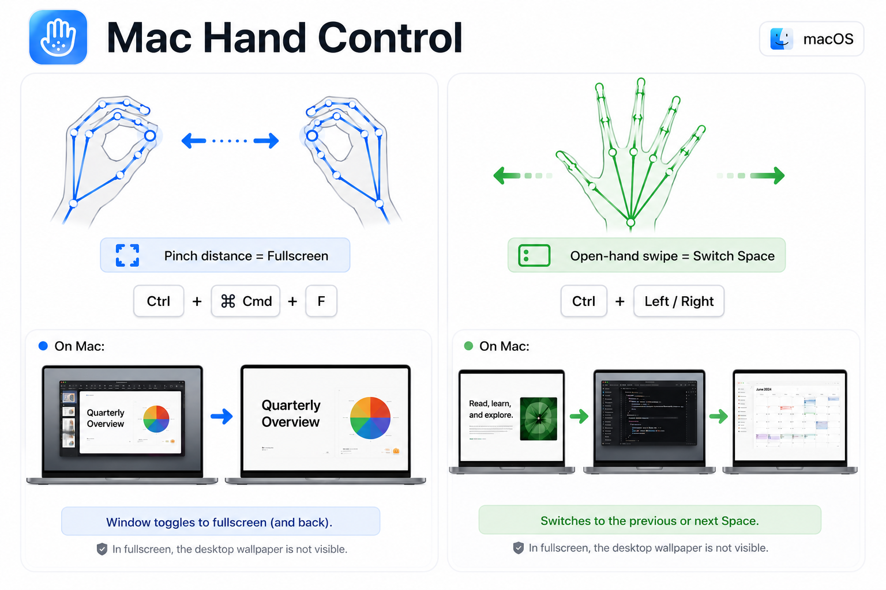

# Mac Hand Control

Native macOS prototype for controlling Spaces and fullscreen with camera hand gestures.



## Gestures

- Fullscreen: pinch with both hands, keep pinching, then spread or squeeze the two hands. This sends `Control + Command + F` to the app you were using.
- Switch Space: swipe one open hand horizontally. A left swipe sends `Control + Right`; a right swipe sends `Control + Left`.
- Move pointer: raise one hand with only the index finger extended. The cursor follows the fingertip.
- Left click: pinch thumb and index finger with one hand, then release.
- Right click: pinch thumb, index, and middle finger together with one hand, then release.
- Scroll: pinch with one hand and move the pinched hand up or down.

The debug panel shows a mirrored camera feed, hand skeletons, yellow thumb-to-index pinch lines, green open-hand markers, and live gesture state for each detected hand.

## Install From Release

Download the latest `Mac-Hand-Control.dmg` or `Mac-Hand-Control.zip` from the GitHub Releases page:

https://github.com/minwoo19930301/mac-hand-control/releases

DMG is the friendlier install path. Open `Mac-Hand-Control.dmg`, then drag `Mac Hand Control.app` into `Applications`.

If you download the zip instead, unzip it and move `Mac Hand Control.app` into `Applications`. Open the app, approve camera access, and use the in-app `Enable AX` button to enable Accessibility control.

Because this prototype is ad-hoc signed instead of Developer ID signed and notarized, macOS may ask for approval in Privacy & Security the first time you open a downloaded copy.

If macOS says the app cannot be checked for malicious software:

1. Try to open `Mac Hand Control.app` once.
2. Open System Settings.
3. Go to Privacy & Security.
4. In the Security section, click Open Anyway for Mac Hand Control.
5. Open the app again and confirm Open.

This manual approval is only needed because the prototype is not notarized. The cleaner distribution path is to sign the app with an Apple Developer ID certificate, enable hardened runtime, submit it to Apple's notary service, staple the notarization ticket, and then build the DMG.

## Build Locally

```sh
./build.sh
```

The build script creates:

```txt
build/Mac Hand Control.app
```

## Package A DMG

```sh
./package.sh
```

The package script builds the app and creates:

```txt
dist/Mac-Hand-Control.dmg
```

## Distribution

For a smoother public install, the next step is signing with an Apple Developer ID certificate and notarizing the DMG. Without that, the app still works, but macOS will show extra security prompts after download.

### Signed Release

After a `Developer ID Application` certificate is installed in Keychain Access, confirm the signing identity:

```sh
security find-identity -v -p codesigning
```

Store Apple notarization credentials once:

```sh
xcrun notarytool store-credentials "mac-hand-control-notary" \
  --apple-id "you@example.com" \
  --team-id "TEAMID"
```

Then build, sign, notarize, and staple the DMG:

```sh
SIGN_IDENTITY="Developer ID Application: Your Name (TEAMID)" \
NOTARY_PROFILE="mac-hand-control-notary" \
./release.sh
```
